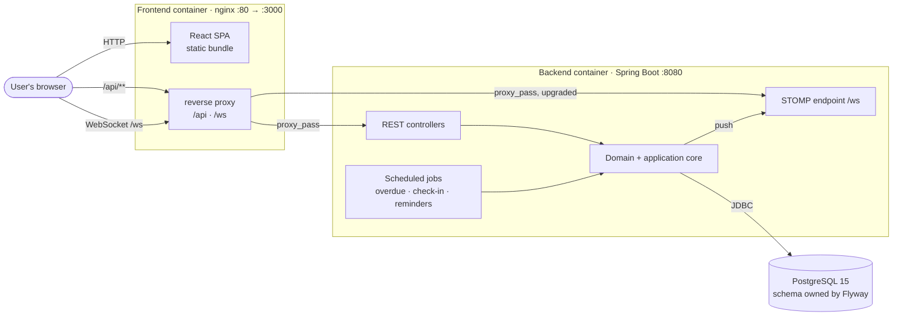

<div align="center">

# UpHealther

**Plan a health change, then find out whether it actually happened** — a tracker for habits,
experiments, goals and one-off health actions, for people who want structure without a coach.

[](https://github.com/NaimElijah/UpHealther/actions/workflows/ci.yml)
[](https://github.com/NaimElijah/UpHealther/commits/main)
[](LICENSE)

[Requirements](docs/requirements/requirements.md) ·
[Architecture](docs/architecture/architecture.md) ·
[Diagrams](docs/architecture/arch-diagrams/README.md) ·
[API](docs/api.md) ·
[Decisions](docs/ADRs/)

</div>



**Contents** · [What and why](#what-and-why) · [Features](#features) ·
[Architecture](#architecture) · [Tech stack](#tech-stack) · [Quick start](#quick-start) ·
[Configuration](#configuration) · [Usage](#usage) · [Development](#development) ·
[Testing](#testing) · [Operations](#operations) · [Project structure](#project-structure) ·
[Design decisions](#design-decisions) · [Status and limitations](#status-and-limitations) ·
[Licence](#licence)

---

## What and why

People who decide to change a health habit rarely fail at the decision — they fail at knowing
whether the change survived contact with a normal week. UpHealther models each intended change as
an **upgrade** with an explicit lifecycle, so "did I actually do this?" is a query rather than a
memory: an upgrade is planned, activated, checked in against, and finally completed or abandoned,
and every one of those moves is a guarded transition rather than an editable status field.

> [!IMPORTANT]
> UpHealther is deliberately **not a medical application**. It gives no advice, diagnosis or
> treatment, and no feature may imply otherwise
> ([non-goal 5.1](docs/requirements/requirements.md#5-non-goals)).

## Features

- Create an upgrade — habit, one-off action, experiment, goal, routine or product replacement — and
  file it under a health area you define
- Move it through a lifecycle the domain guards: `IDEA → PLANNED → ACTIVE ⇄ PAUSED → COMPLETED /
  ABANDONED`, where an illegal move is a 422 with a reason rather than a silent write
- Choose how each upgrade is measured — boolean, numeric, rating or text — and log a day against it;
  the server scores the entry rather than trusting the client's `completed` flag
- Check in on every active upgrade at once from a single daily page
- Read current and longest streaks, today's and this week's entries, and a dashboard of what is
  active, overdue and completed
- Record reflections against an upgrade: what worked, what did not, what to adjust
- Receive reminders and notifications, pushed live over a WebSocket and persisted so an offline
  client still sees them
- Switch between light and dark themes, applied before the first paint — no wrong-theme flash

## Architecture

Three processes and a browser, shown above. No message broker, no cache, no third-party service:
every piece of state is in the one database, and every side effect is either a write to it or a
message pushed to a connected browser.

The backend is **nine bounded contexts over a shared kernel** — `auth`, `user`, `healtharea`,
`upgrade`, `tracking`, `reflection`, `reminder`, `dashboard`, `notification` — each a hexagon:
adapters depend on the core, and the core depends on nothing outside itself. Three of them
(`upgrade`, `healtharea`, `user`) depend on no other context at all, and the graph is acyclic.
That graph is read off the `import` statements rather than drawn, and CI fails when it stops
matching the code — see the
[context map](docs/architecture/arch-diagrams/README.md#2-bounded-context-map).

**One request, end to end.** `POST /api/upgrades/{id}/progress` arrives at nginx and is proxied to
the API. `JwtAuthenticationFilter` validates the bearer token and re-loads the user, so a deleted
account stops working immediately. `ProgressController` hands a command to `TrackingService`, which
asks the `upgrade` context for the upgrade *scoped to that user* — ownership is enforced by the
query being user-scoped, so another user's row is a 404 rather than a 403. The service rejects a
duplicate entry for the same upgrade and date, scores the entry against its tracking configuration,
and saves it through an outbound port the domain owns. Domain events are published `AFTER_COMMIT`,
so nothing is pushed or persisted as a notification if the transaction rolls back.

`HealthUpgrade` owns the state machine and has no setter for its status. `COMPLETED` is terminal;
`ABANDONED` is not — rescheduling revives it. At most three `HARD` upgrades may be `ACTIVE` at once,
checked both when activating one and when promoting a running one to `HARD`.

The layering is **enforced, not documented**: `HexagonalArchitectureTest` runs eleven ArchUnit rules
on every `mvn test` — the domain stays framework-free, the application depends on no adapter, and
Spring Data is confined to the persistence adapters.

Seven diagrams, outside in: [arch-diagrams](docs/architecture/arch-diagrams/README.md). The prose:
[architecture.md](docs/architecture/architecture.md). The why: [ADRs](docs/ADRs/).

## Tech stack

| Layer | Technology | Version | Why |
|:---|:---|---:|:---|
| Language | Java | 21 | Records carry the command, port and DTO layer, which is most of the boundary code |
| Framework | Spring Boot | 3.2.5 | Confined to the adapters; ArchUnit keeps it out of the domain |
| Auth | Spring Security + JJWT | Boot-managed / 0.12.3 | Stateless bearer tokens, no server-side session to replicate |
| Database | PostgreSQL | 15 | The partial unique constraint and optimistic locking the domain relies on are real constraints, not application checks |
| Migrations | Flyway | 9.22.3 | Flyway owns the schema; Hibernate runs `ddl-auto: validate` and refuses to start against one that does not match |
| Observability | Micrometer Tracing, Prometheus registry, Logstash encoder | Boot-managed / 7.4 | W3C `traceparent` on the wire and vendor-neutral; JSON logs whose trace id is a field, not a substring |
| Frontend | React + TypeScript | 18.3.1 / 5.9.3 | Enums mirrored from the backend, with a test that fails when they drift |
| Build | Vite | 5.4.21 | Same `/api` proxy in dev as nginx serves in prod, so both sides behave identically |
| Data fetching | TanStack Query | 5.100.10 | Cache invalidation per mutation instead of hand-rolled refetching |
| Styling | Tailwind CSS | 3.4.19 | Semantic tokens only — `npm run check:colours` fails on a raw palette colour |
| Real-time | STOMP over WebSocket | 7.3.0 | Push reuses the JWT via a channel interceptor rather than a second auth scheme |
| Tests | JUnit 5, ArchUnit, Testcontainers / Vitest | 1.3.0 / 1.21.4 / 3.2.7 | Real PostgreSQL in the integration suite; architecture rules as ordinary tests |

## Quick start

**Prerequisites:** Docker 24+ with Compose v2. Nothing else — the toolchain runs in containers.

```bash
git clone https://github.com/NaimElijah/UpHealther.git && cd UpHealther
docker compose up --build
```

Frontend at **http://localhost:3000**, API at **http://localhost:8080**. Compose waits for the
backend to report *ready* before starting the frontend, so the first page load is never proxied to
an API still migrating its schema — expect roughly a minute on a cold build.

Sign in with the seeded demo account **`demo@healthupgrades.com` / `demo1234`**. Every variable has
a working default, so no `.env` is needed to start — copy `.env.example` to `.env` only to override.

<details>
<summary>If it does not come up</summary>

- **`port is already allocated` on 5432** — a host PostgreSQL owns the port. Stop it, or drop the
  `ports:` mapping on the `postgres` service; the backend reaches it over the compose network anyway.
- **Backend restarts, logs mention Flyway** — a stale `postgres_data` volume. `docker compose down -v`.
- **Frontend loads, every call fails** — `curl http://localhost:8080/actuator/health/readiness`.

</details>

## Configuration

Mirrors [`.env.example`](.env.example). The defaults are for local development only; `JWT_SECRET` is
a published value and gives no security.

| Variable | Purpose | Default | Required |
|---|---|---|---|
| `POSTGRES_DB` | Database name created by the compose Postgres | `healthupgrades` | No |
| `POSTGRES_USER` | Database user created by the compose Postgres | `healthupgrades` | No |
| `POSTGRES_PASSWORD` | Password for that user | `healthupgrades` | In a deployment |
| `JWT_SECRET` | Token signing key; at least 256 bits or the application refuses to start | published dev value | In a deployment |
| `DB_URL` | JDBC URL the backend connects to | `jdbc:postgresql://localhost:5432/healthupgrades` | Outside compose |
| `DB_USERNAME` | Database user the backend connects as | `healthupgrades` | Outside compose |
| `DB_PASSWORD` | Password for that user | `healthupgrades` | Outside compose |
| `CORS_ALLOWED_ORIGINS` | Cross-origin callers, and the `/ws` handshake origins; unused behind the `/api` proxy | `http://localhost:3000` | No |
| `SPRING_PROFILES_ACTIVE` | `json-logs` switches log output to one JSON object per line; compose sets it | empty locally | No |
| `LOG_LEVEL_APP` | Level for `com.healthupgrades` only | `INFO` | No |
| `VITE_API_URL` | Backend URL for the frontend. Leave empty to use the same-origin `/api` proxy | empty | No |

Three more live only in `application.yml` — `UPGRADE_OVERDUE_CRON` (`0 0 8 * * *`),
`NOTIFY_CHECKIN_CRON` (`0 0 18 * * *`) and `NOTIFY_REMINDERS_CRON` (`0 * * * * *`). They are
absent from `.env.example`, and `docker-compose.yml` does not pass them through, so they take
effect on a native run only.

## Usage

`POST /api/auth/login` with the demo credentials returns `200` and
`{ "token": …, "user": { "id", "name", "email", "createdAt" } }`. Export that token as `$TOKEN`;
every call below sends it as a bearer.

Create an upgrade — `201`, and it starts in `IDEA` because status moves only through the transition
endpoints:

```bash
curl -sX POST http://localhost:8080/api/upgrades \
  -H "Authorization: Bearer $TOKEN" -H 'Content-Type: application/json' \
  -d '{"title":"Walk 8k steps","type":"HABIT","difficulty":"MEDIUM"}'
```

The response carries all eighteen fields of the upgrade — nulls are serialised rather than omitted,
so a client can rely on every key being present. A complete request-and-response pair is in
[docs/api.md](docs/api.md#a-created-upgrade-in-full).

A move the state machine forbids is refused by the domain, not the controller — `422`, with the
`traceId` that finds the log line for it:

```bash
curl -sX POST "http://localhost:8080/api/upgrades/0f2c8f5a.../complete" \
  -H "Authorization: Bearer $TOKEN"
```

```json
{
  "status": 422,
  "message": "Only ACTIVE upgrades can be completed",
  "path": "/api/upgrades/0f2c8f5a.../complete",
  "timestamp": "2026-01-14T09:13:40",
  "traceId": "65b2c0f4a1d3e8b7"
}
```

The rest of the surface — every endpoint, the full status contract, and the error body — is in
[**docs/api.md**](docs/api.md).

## Development

Running natively needs **JDK 21**, **Maven 3.8+**, **Node 20+**, and a PostgreSQL 15 on `:5432`.

```bash
docker compose up -d postgres               # or bring your own PostgreSQL

cd backend  && mvn spring-boot:run          # terminal 1 — :8080, migrates on start
cd frontend && npm install && npm run dev   # terminal 2 — :3000, proxies /api to :8080
```

The backend falls back to the development defaults in `application.yml`, so a fresh clone runs
with nothing set in the environment.

**Migrations** are Flyway SQL in `backend/src/main/resources/db/migration`, named `V{n}__snake_case.sql`
and append-only — Hibernate validates the entities against the schema and refuses to start on a
mismatch, so an entity change needs a new migration rather than a `ddl-auto` change.

**Conventions.** Conventional Commits (`type(scope): imperative subject`), branches
`type/short-kebab-description`, one logical change per commit. Formatting is pinned by
[`.editorconfig`](.editorconfig) and line endings by [`.gitattributes`](.gitattributes).

**Adding a feature end to end**, in the order the files come: behaviour into `domain/model` (or
`domain/service`) with a failing test; what it needs from outside into `domain/port/out`; a
`@Transactional` service in `application` with its command and result records in
`application/port/in`; the port implemented in `adapter/out/persistence`; the route in
`adapter/in/web` with a request record, DTO and mapper; the Flyway migration; then
`frontend/src/api` and the page. `HexagonalArchitectureTest` fails the build on any arrow that runs
the wrong way.

## Testing

| Level | Covers | Command |
|---|---|---|
| Domain | The `HealthUpgrade` state machine and construction invariants, streaks, reminder scheduling, entry scoring | `mvn test` |
| Application | Every use case in every context, including what a *rejected* operation must not leave behind | `mvn test` |
| Web slice | Each controller against the real security chain: status codes, validation, another user's row as a 404 | `mvn test` |
| Structural | Eleven ArchUnit rules, plus the frontend enum contract | `mvn test` |
| Integration | The app booted against a real PostgreSQL — bean graph, migrations, database-enforced invariants | `mvn verify` |
| Frontend | Session restore and 401 expiry, the notification socket, the route gate, theme, error boundary | `npm run test` |

```bash
cd backend
mvn test        # 465 unit and structural tests — no database, no Docker
mvn verify      # the above plus 39 integration tests in 8 *IT classes — needs Docker

cd ../frontend
npm run lint && npm run check:colours && npm run test
```

The integration suite starts its own `postgres:15-alpine` through Testcontainers, so nothing needs
provisioning first and CI runs the same `verify`
([ADR-008](docs/ADRs/ADR-008-testcontainers-for-the-integration-test-database.md)).

**What CI gates on** ([`ci.yml`](.github/workflows/ci.yml), every push and PR to `main` and `dev`):
`mvn clean verify`; the generated diagrams still matching their source; frontend lint at
`--max-warnings 0`; the colour-token check; `vitest run --coverage`; `npm audit --omit=dev
--audit-level=high`; and the production build.

**Coverage is reported, never gated** — both suites publish one every run, no threshold fails a
build. The gate is [`requirements.md`](docs/requirements/requirements.md), where every requirement
names the test enforcing it ([ADR-009](docs/ADRs/ADR-009-test-levels-boundaries-and-naming.md)).

## Operations

> [!NOTE]
> **Nothing is deployed.** This runs locally under Compose and has never run in a hosted
> environment, so there is no pipeline and no published image. What follows are facts about the
> code, not a description of a deployment.

| Concern | Where |
|---|---|
| Liveness | `GET /actuator/health/liveness` |
| Readiness | `GET /actuator/health/readiness` — not ready until Flyway has finished; both images declare a `HEALTHCHECK` against it |
| Metrics | `GET /actuator/prometheus` — HTTP latency, error rate, JVM, HikariCP saturation, audit and scheduled-job counters |
| Traces | Micrometer Tracing over the OpenTelemetry bridge; sampled at 1.0, **no exporter configured**, so no span leaves the process |
| Logs | `docker logs` only — one JSON object per line under compose, Boot's readable pattern locally |
| Correlation | Every line carries a trace id, returned as the `X-Trace-Id` header and on the error body — with two exceptions, below |
| Audit | The `AUDIT` logger — `action`, `outcome`, `actorId`, `resourceId`; enums and identifiers only, never personal data |

Migrations run at application start, so a bad one leaves the container un-ready rather than
corrupting the schema. To chase a reported failure:
`docker logs healthupgrades-backend | grep <trace id>`.

## Project structure

```
backend/           Spring Boot API — nine bounded contexts, hexagonal, ArchUnit-enforced
  src/main/java/     com.healthupgrades.<context>/{domain,application,adapter} + common/
  src/main/resources/  application.yml, logback-spring.xml, db/migration/V{n}__*.sql
  src/test/java/     domain · application · web slice · architecture · *IT
frontend/          React + TypeScript SPA, served by nginx in production
  src/api/           Typed client per resource, the axios instance, error mapping
  src/pages/         One page per route; components/, contexts/, hooks/ alongside
docs/              The documentation the repository baseline requires
  requirements/      What the system must do, each naming its enforcing test
  architecture/      What the system is, plus seven diagrams (three generated)
  ADRs/              Why — one file per decision, append-only
.github/workflows/ CI: backend verify, diagram drift, frontend lint/test/audit/build
```

## Design decisions

**DDD + hexagonal, boundaries enforced by tests** ([ADR-001](docs/ADRs/ADR-001-ddd-hexagonal-architecture.md),
corrected by [ADR-002](docs/ADRs/ADR-002-close-the-gap-between-the-described-and-enforced-architecture.md))
— the lifecycle rules *are* the product, and conventional service/repository layering scatters them
where nothing stops a controller reaching the database. **Cost:** many more types, so a small feature
touches more files; entities stay JPA-annotated, so the domain is not persistence-ignorant.

**A real PostgreSQL in the integration tests, started by the tests**
([ADR-008](docs/ADRs/ADR-008-testcontainers-for-the-integration-test-database.md)) — an embedded H2
was rejected outright: the schema is PostgreSQL-specific, Hibernate boots with `validate`, and the
invariants that most need a real database (a partial unique constraint, optimistic locking under
concurrent writes) are where compatibility modes diverge. A CI service container was rejected for
keeping the two environments different. **Cost:** `mvn verify` needs Docker and runs slower.

**Coverage is reported, never gated** ([ADR-009](docs/ADRs/ADR-009-test-levels-boundaries-and-naming.md))
— a threshold is satisfied by tests written to move a number and says nothing about whether a rule is
enforced. **Cost:** the gate is a document, so it holds only while that table is maintained.

**The audit trail is a log stream, not a table** ([ADR-011](docs/ADRs/ADR-011-audit-as-a-log-stream.md))
— an `audit_log` table rolls back with the very refusal it was recording unless it gets its own
transaction, and Envers records versions of rows rather than attempts by people, so it cannot record
refusals at all. **Cost:** the container log's retention *is* the audit trail's retention — adequate
for diagnosis, explicitly not a compliance story.

**Source-available, not open source** ([ADR-003](docs/ADRs/ADR-003-proprietary-source-available-licensing.md))
— MIT and Apache-2.0 permit exactly what was not intended: anyone building on the work commercially,
with attribution buried in a notices file. AGPL grants more than intended and is banned outright at
many organisations. **Cost:** nobody may use or run the code without written permission, which rules
out outside contribution.

## Status and limitations

**Feature-complete and unshipped.** Every capability above works and is covered — 465 unit and
structural tests, 39 integration tests, 126 frontend tests, all green — but it has never run in a
hosted environment, has no release tags, and is versioned `0.0.1-SNAPSHOT`.

Known limitations, load-bearing rather than accidental:

- **Single instance only.** The STOMP broker is in-memory, so a push reaches only clients connected
  to the instance that raised it; others see the persisted notification on their next fetch. More
  than one instance needs a broker relay first.
- **No backend dependency audit.** OWASP dependency-check cannot populate its database without an
  `NVD_API_KEY`, and a check that always fails — or cannot fail — was judged worse than none. The
  frontend's shipped dependencies *are* audited on every run.
- **Observability stops at the process.** `docker logs` is the only sink, so its retention is the
  audit trail's retention; nothing scrapes `/actuator/prometheus`; no span leaves the process; the
  SPA has no telemetry, so `ErrorBoundary` can show an error and nothing else knows.
- **Two paths carry a trace id in the header but not the body** — an anonymous request to a
  protected endpoint (rejected in the security chain as a `403`, no `AuthenticationEntryPoint`
  configured), and a container error dispatch outside the observation scope.
- **No screenshots yet.** The system-context diagram stands in until the UI is captured.

Planned, and deliberately absent from every section above: push notifications, progress export,
internationalisation, wearable integration. Sharing, accountability partners and a public API are
**non-goals** rather than backlog ([§5](docs/requirements/requirements.md#5-non-goals)).

## Contributing

Outside contribution is not possible under the licence below — the code may be read, not modified.
Corrections and questions are welcome as [issues](https://github.com/NaimElijah/UpHealther/issues).

---

## Licence

> [!IMPORTANT]
> UpHealther is **source-available, not open source**. Reading, reviewing and evaluating it is the
> whole of the permission granted — it may not be used, copied, modified, run or redistributed.

**Copyright © 2026 Naim Elijah. All rights reserved.** Published so it can be read, reviewed and
evaluated. Anything beyond reading — using, copying, modifying, running, deploying, redistributing, or
training a model on it — needs written permission, via
[github.com/NaimElijah](https://github.com/NaimElijah); an unanswered request is a refused one.

[`LICENSE`](LICENSE) carries the terms that govern. Third-party dependencies remain under their own.

## Acknowledgements

The ADR format is Michael Nygard's; the ports-and-adapters shape is Alistair Cockburn's, and the
context boundaries Eric Evans' *Domain-Driven Design*.
