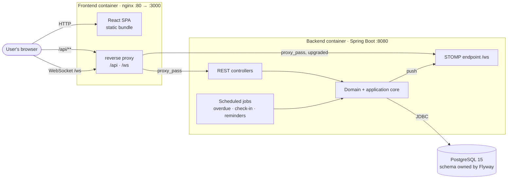
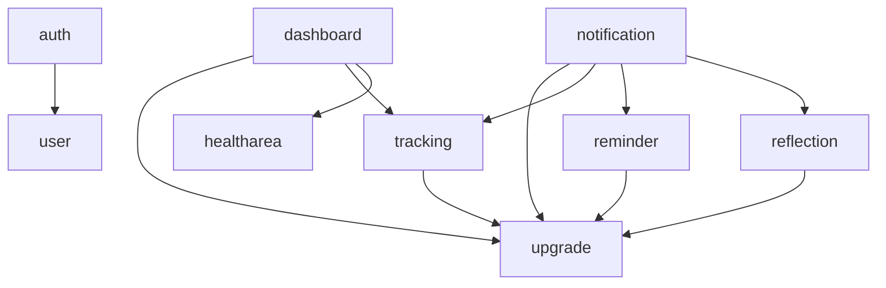
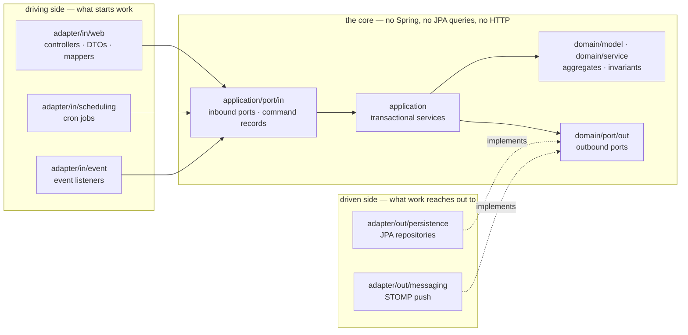
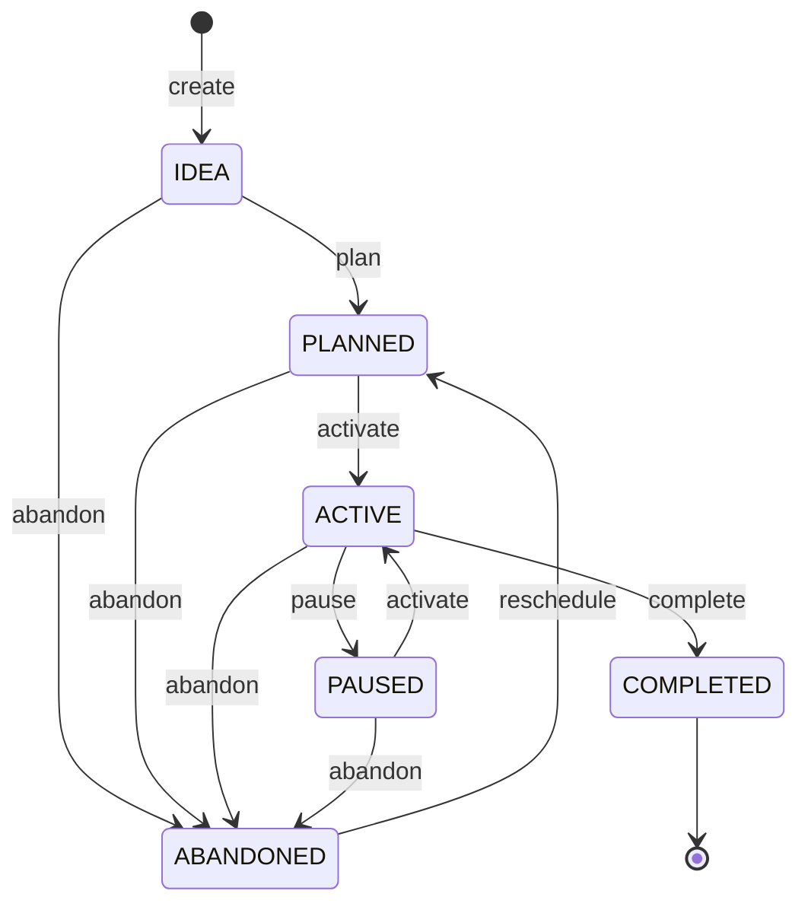
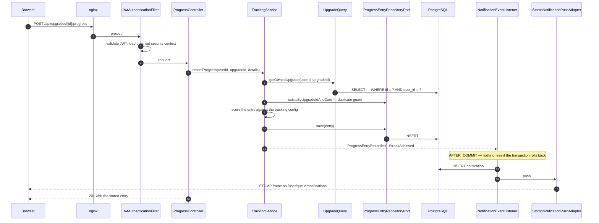
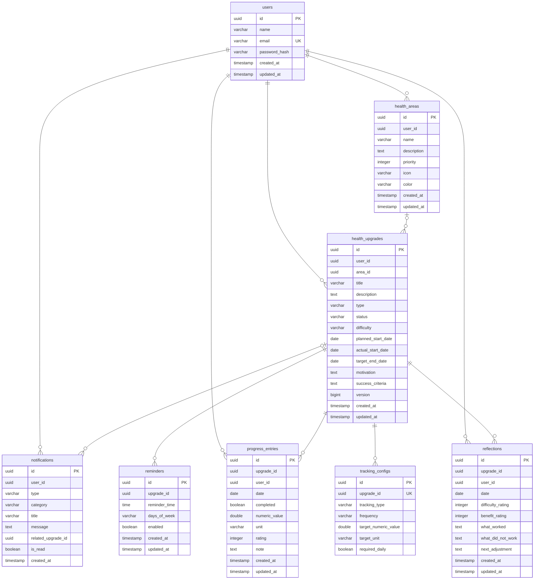

# Architecture diagrams

Seven views of UpHealther, ordered from the outside in: what the moving parts are, how the backend
is divided, how one division is shaped, what one of them contains, how its core object moves through
its life, how a request travels, and what is stored.

Read them in order and you have the system. For the prose that goes with them see
[`../architecture.md`](../architecture.md); for why any of it is shaped this way, see
[`../../ADRs/`](../../ADRs/).

> **Three of these are generated, not drawn.** The context map, the class diagram and the ER diagram
> are derived from the imports, the package layout and the Flyway migrations respectively, by
> [`generate.py`](generate.py). CI fails if the committed output stops matching the source, so a
> diagram here cannot quietly go out of date. The other three describe intent rather than structure,
> do not rot, and are written by hand.

---

## 1. System context

Three processes and a browser. There is no message broker, no cache and no third-party service —
every piece of state is in the one database, and every side effect is either a write to it or a
message pushed to a connected browser.



Same-origin by design: the browser only ever talks to the frontend's origin, and the proxy forwards
`/api` and `/ws` onward. In development the Vite dev server does the same job, so both sides behave
identically.

---

## 2. Bounded-context map

The backend is nine bounded contexts over a shared kernel. This graph is read off the `import`
statements — it is what the code does, not what anyone intended.

<!-- generated:context-map -->

<!-- /generated:context-map -->

`common` is excluded: every context depends on it by definition, so drawing it would add ten edges
that say nothing. The absent edge is the interesting one — `upgrade` points at nothing, even though
an upgrade's response carries its tracking configuration. That inversion is
[ADR-002](../../ADRs/ADR-002-close-the-gap-between-the-described-and-enforced-architecture.md).

---

## 3. How to read a context

Every context is the same shape, so learning it once is enough. Arrows run **inward**: adapters
depend on the core, and the core depends on nothing outside itself. The driven side is inverted —
persistence and messaging *implement* ports the core declares, rather than the core calling them.



This is not a convention anyone has to remember — `HexagonalArchitectureTest` fails the build on
every arrow that runs the wrong way. Two contexts are deliberately smaller than this: `auth`
orchestrates over `user` and owns no aggregate, and `dashboard` is a read model with no driven side.

---

## 4. Inside one context — `upgrade`

The core context, and the one worth reading in full: it owns `HealthUpgrade`, the aggregate whose
state machine the whole product is built around. Every other context follows the shape from §3.

Relations shown are **implements**, **extends**, and *holds a field of this type* — the composition
that reveals the wiring. Accessors and framework plumbing are left out on purpose; the interesting
content is which layer a type sits in and which way its arrows point.

Two things are therefore absent by construction, and neither means what it looks like. Dependencies on
`common` and on Spring are out of scope — `UpgradeService` also holds a `DomainEventPublisher` and a
`Clock`. And a type *constructed in a method* rather than held as a field draws no arrow, which is why
nothing connects `UpgradeBeansConfig` to `UpgradeSchedulingService` even though wiring that bean is the
only reason the class exists.

```mermaid
classDiagram
    direction LR

    %% ---- domain model ----
    class Difficulty {
        <<domain model · enum>>
    }
    class HealthUpgrade {
        <<domain model>>
    }
    class UpgradeStatus {
        <<domain model · enum>>
    }
    class UpgradeType {
        <<domain model · enum>>
    }

    %% ---- domain event ----
    class HealthUpgradeAbandoned {
        <<domain event>>
    }
    class HealthUpgradeActivated {
        <<domain event>>
    }
    class HealthUpgradeCompleted {
        <<domain event>>
    }
    class HealthUpgradeCreated {
        <<domain event>>
    }
    class HealthUpgradePaused {
        <<domain event>>
    }
    class HealthUpgradePlanned {
        <<domain event>>
    }
    class UpgradeOverdueDetected {
        <<domain event>>
    }

    %% ---- domain service ----
    class UpgradeSchedulingService {
        <<domain service>>
    }

    %% ---- outbound port ----
    class UpgradeRepositoryPort {
        <<outbound port>>
    }
    class UpgradeTrackingSummaryPort {
        <<outbound port>>
    }

    %% ---- port record ----
    class UpgradeTrackingSummary {
        <<port record>>
    }

    %% ---- application ----
    class UpgradeService {
        <<application>>
    }

    %% ---- bean wiring ----
    class UpgradeBeansConfig {
        <<bean wiring>>
    }

    %% ---- inbound port ----
    class UpgradeQuery {
        <<inbound port>>
    }

    %% ---- use-case record ----
    class UpgradeDetails {
        <<use-case record>>
    }

    %% ---- web adapter ----
    class ActivateRequest {
        <<web adapter>>
    }
    class PlanRequest {
        <<web adapter>>
    }
    class RescheduleRequest {
        <<web adapter>>
    }
    class UpgradeController {
        <<web adapter>>
    }
    class UpgradeDto {
        <<web adapter>>
    }
    class UpgradeRequest {
        <<web adapter>>
    }
    class UpgradeTrackingConfigDto {
        <<web adapter>>
    }
    class UpgradeWebMapper {
        <<web adapter>>
    }

    %% ---- scheduling adapter ----
    class UpgradeOverdueScheduler {
        <<scheduling adapter>>
    }

    %% ---- persistence adapter ----
    class UpgradeJpaRepository {
        <<persistence adapter>>
    }
    class UpgradeRepositoryAdapter {
        <<persistence adapter>>
    }

    %% ---- relations: implements, extends, and fields typed by another type ----
    HealthUpgrade --> Difficulty
    HealthUpgrade --> UpgradeStatus
    HealthUpgrade --> UpgradeType
    UpgradeController --> UpgradeService
    UpgradeController --> UpgradeWebMapper
    UpgradeDetails --> Difficulty
    UpgradeDetails --> UpgradeType
    UpgradeDto --> Difficulty
    UpgradeDto --> UpgradeStatus
    UpgradeDto --> UpgradeTrackingConfigDto
    UpgradeDto --> UpgradeType
    UpgradeOverdueScheduler --> UpgradeQuery
    UpgradeRepositoryAdapter --> UpgradeJpaRepository
    UpgradeRepositoryAdapter ..|> UpgradeRepositoryPort : implements
    UpgradeRequest --> Difficulty
    UpgradeRequest --> UpgradeType
    UpgradeService --> UpgradeRepositoryPort
    UpgradeService --> UpgradeSchedulingService
    UpgradeService ..|> UpgradeQuery : implements
    UpgradeWebMapper --> UpgradeTrackingSummaryPort
```

<!-- generated:class-diagram -->

<!-- /generated:class-diagram -->

Read the stereotypes as layers. Note that `UpgradeService` holds `UpgradeRepositoryPort` — an
interface in the domain — and never the adapter that implements it, which is the whole point.

---

## 5. The upgrade lifecycle

The state machine `HealthUpgrade` owns. Status changes only through these named transitions — the
aggregate has no setter for it — and each one guards itself, so an illegal move is a 422 with a reason
rather than a silently accepted write.



`COMPLETED` is terminal; `ABANDONED` is not — rescheduling revives it, which is the one transition not
named after its destination. An upgrade occupies one of the three concurrent `HARD` slots only while
`ACTIVE`, which is why that limit is checked both when activating one and when promoting a running one
to `HARD`. Every transition here is pinned by `HealthUpgradeTest`.

---

## 6. Request lifecycle

Logging a day's progress, end to end. Chosen because it touches almost everything: authentication,
cross-context ownership checks, a domain invariant, an event, and both delivery transports.



Three things worth noticing: ownership is enforced by the *query* being user-scoped rather than by a
guard, so a foreign row is indistinguishable from a missing one; the server scores the entry rather
than trusting the client's `completed` flag; and the push happens only after commit, while the
notification is persisted either way so an offline client still sees it.

---

## 7. Data model

Tables, keys and foreign keys, read from the Flyway migrations. The schema is owned by Flyway and
Hibernate runs with `ddl-auto: validate`, so this is authoritative — the application refuses to start
against a schema that does not match it.

<!-- generated:er-diagram -->

<!-- /generated:er-diagram -->

The two constraints doing real work: `progress_entries` is unique on `(upgrade_id, date)`, which is
what makes "one entry per upgrade per day" survive a race the application-level check would miss; and
`tracking_configs.upgrade_id` is unique, so an upgrade has at most one configuration.

---

## Regenerating

```bash
python docs/architecture/arch-diagrams/generate.py           # rewrite the generated diagrams
python docs/architecture/arch-diagrams/generate.py --check   # fail if they are out of date (CI runs this)
```

Editing a generated region by hand is pointless — the next run overwrites it, and CI will fail before
then. Change the code, then regenerate.
