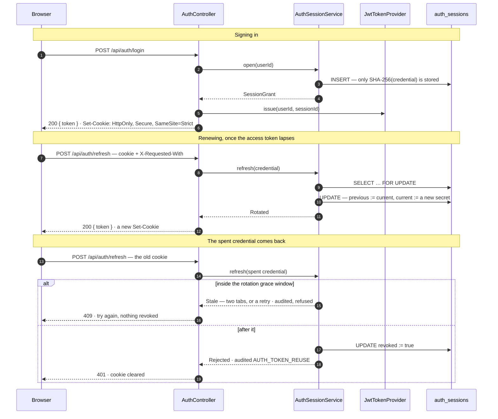

# Architecture

The system as it actually is, at the time of writing. This record describes **what** is built and
**how the pieces fit**; it does not argue for any of it. The reasoning, the alternatives that were
rejected, and the conditions that would make us revisit a choice live in [`docs/ADRs/`](../ADRs/).

---

## Architecture overview

UpHealther is a three-process web application: a React single-page app, a Spring Boot HTTP API,
and a PostgreSQL database. There is no message broker, no cache, no third-party service and no second
backend — every piece of state lives in the one database, and every side effect the API performs is
either a write to it or a message pushed to a connected browser.

The browser talks to the API over HTTP for everything it reads and writes, and holds an additional
WebSocket connection that the API uses to push notifications as they are raised. Both travel to the
same origin: a proxy in front of the SPA forwards `/api` and `/ws` to the API, so the browser makes no
cross-origin request in the default setup.

Inside the API, the code is organised as ten bounded contexts over a ports-and-adapters core. The
domain and application layers know nothing about HTTP, JPA or Spring's event bus; each of those
arrives through an adapter. The boundaries are not a convention — they are checked on every build by
an ArchUnit suite, which is the authority on what the layering permits.

> **Diagram:** [System context](arch-diagrams/README.md#1-system-context) — the three
> processes, the browser, and what each connection carries.

---

## Components

### Runtime processes

| Component | What it is | Responsible for |
|---|---|---|
| **Frontend** | nginx serving a Vite production build (container port 80, published on 3000) | Serving the SPA, and proxying `/api` and `/ws` to the backend so the browser stays same-origin |
| **Backend** | Spring Boot 3.2 on Java 21, executable jar (port 8080) | The whole domain: authentication, the upgrade lifecycle, tracking, reflections, reminders, the dashboard read model, notifications, and the scheduled jobs |
| **Database** | PostgreSQL 15 (port 5432, volume `postgres_data`) | Every piece of persistent state. Schema owned by Flyway |

In development the nginx container is not involved: the Vite dev server serves the SPA on 3000 and
performs the same `/api` and `/ws` proxying itself, so the app behaves identically on both sides.

### Backend bounded contexts

Ten contexts, each owning its own vocabulary, plus a cross-cutting `common`.

| Context | Owns | Shape |
|---|---|---|
| `upgrade` | `HealthUpgrade` — the core aggregate and its state machine | Full: domain, application, adapters |
| `tracking` | `TrackingConfig`, `ProgressEntry`, streak and success evaluation | Full |
| `reflection` | `Reflection` — periodic written reviews | Full |
| `reminder` | `Reminder` and its day-of-week schedule | Full |
| `notification` | `Notification` — the inbox and the real-time push | Full, and the only context with a messaging adapter |
| `healtharea` | `HealthArea` — the groupings upgrades are filed under | Full |
| `user` | `User` — identity and the stored password hash; `EmailAddress`, the one rule for when two addresses are the same identity | Full |
| `auth` | Registration, sign-in, sign-out, and the sessions tokens are issued within | `AuthSession` — a signed-in session, the row that makes revocation possible; orchestrates over `user` for identity |
| `admin` | Listing accounts, switching one off or back on, and granting or revoking a role | Two-layer: orchestrates over `user` and `auth`, owns no aggregate. It depends on no context holding a user's own records, and ArchUnit keeps it that way |
| `dashboard` | The composed dashboard read model | Two-layer: reads through other contexts' ports, persists nothing |
| `common` | Cross-cutting: the `DomainEvent` marker, shared exceptions, the event-publisher port, the global exception handler, JWT security and the WebSocket configuration | Not a context; a shared kernel plus cross-cutting adapters |

The shapes that differ are deliberate, not drift. `dashboard` is two-layer by design
([ADR-002](../ADRs/ADR-002-close-the-gap-between-the-described-and-enforced-architecture.md)); `auth` began
that way and gained an aggregate with sessions
([ADR-015](../ADRs/ADR-015-server-side-sessions-behind-a-rotating-refresh-cookie.md)); and `admin` owns
no aggregate at all, orchestrating over `user` and `auth`.

### Frontend modules

| Module | Responsible for |
|---|---|
| `src/api/` | One axios instance and a thin function per endpoint. The instance attaches the in-memory access token, and renews it from the refresh cookie and retries once on a 401 rather than signing the user out; `tokenStore.ts` holds the token, and every call goes through the instance |
| `src/contexts/` | `AuthProvider` owns the session; `NotificationProvider` owns the notification list, the unread count (the server's, since the list holds only the fifty most recent; the unread listed stands in until it can be read), the STOMP connection and the toasts; `ThemeProvider` owns the light/dark/system choice and the `dark` class on `<html>` |
| `src/hooks/` | `useAuth`, `useNotifications` and `useTheme` — typed context readers that fail loudly outside their provider |
| `src/router/` | The route table, and `ProtectedRoute`, which gates every authenticated page |
| `src/pages/` | One component per route |
| `src/components/` | `ui/` primitives — including `PageContainer`, which decides how wide a page may grow — `upgrade/` cards and badges, `notifications/` bell, dropdown, items and toasts, `layout/` navbar, sidebar and the phone menu, the last two rendering one shared list of links |
| `src/types/` | Hand-written mirrors of the backend's response shapes and enums |
| `src/lib/` | Framework-free helpers shared by several pages. `localDate.ts` turns the API's zone-less `YYYY-MM-DD` dates into the user's own day and back, because JavaScript's shortcuts for both go through UTC |

---

## Communication

Five distinct mechanisms, each used for one thing:

The two endpoints reachable without a credential — sign-in and registration — are rate-limited per
client address by a handler interceptor, which runs before any controller so a refused attempt costs
no password comparison. The address it counts is the one nginx reported, and only nginx's own address
is trusted to report one
([ADR-017](../ADRs/ADR-017-an-in-process-fixed-window-rate-limit-per-client-address.md)).

**1. HTTP, browser to API.** Every read and write. JSON in and out, JWT bearer token in the
`Authorization` header. The token names its account by id in `sub` and carries nothing else that
identifies it, and it is accepted only under this application's issuer, audience and signing
algorithm, so one minted by another service that happens to share the secret is refused.
`BearerTokenAuthenticator` is the single place those rules live — the HTTP filter and the STOMP
interceptor both authenticate through it, so the two transports cannot drift apart. It re-reads the
account on every request, so the role it holds and whether it is enabled are decided by the row as
it stands and never by the token: revoking ADMIN, or switching an account off, takes effect on the
next request rather than whenever the token happens to lapse. Same-origin
through the proxy, so no CORS preflight in the default setup; the `CORS_ALLOWED_ORIGINS` policy
exists only for deployments that split the origins.

**2. STOMP over WebSocket, API to browser.** One-way in practice: the browser connects and subscribes,
the API pushes. The handshake itself is unauthenticated — a browser cannot set headers on it — so the
JWT travels in the STOMP `CONNECT` frame and is validated by a channel interceptor, which attaches a
principal named by user id. Messages are routed to `/user/queue/notifications`, which the broker
resolves per session using that principal. Every CONNECT that presents a credential is audited as
`auth.connect`, allowed or refused (NFR-23), because the socket stays signed in as that user for as long
as it is open; a refusal names nobody, as a refused login does. A CONNECT with no `Authorization` header
— what a tab whose session could not be renewed sends every five seconds — presented nothing and is not
an entry, as a refresh with no cookie is not.

The same interceptor authorises the frames that follow, because a session that is merely connected
can still name any destination it likes. A SUBSCRIBE must come from an authenticated session and
name `/user/queue/notifications` exactly — the resolved `/queue/notifications-user…` of another
session, and any `/topic`, are refused — and a SEND is refused outright, the application declaring
no `@MessageMapping` for one to reach. Heartbeats, UNSUBSCRIBE and DISCONNECT pass untouched:
they name nothing, and refusing a DISCONNECT would leave sessions to time out rather than close.
A refused SUBSCRIBE or SEND is a WARN line, not an audit entry: it authorises a frame on a connection
that is already authenticated.

The broker is Spring's in-memory simple broker. There is no external broker, so a push reaches only
clients connected to *this* instance — see "Known constraints" below.

**3. In-process domain events, context to context.** A context that changes state publishes a record
implementing `DomainEvent` through the `DomainEventPublisher` port. The adapter behind it delegates to
Spring's `ApplicationEventPublisher`, so consumers can bind to the transaction:
`@TransactionalEventListener(AFTER_COMMIT)` means a notification is never raised for a write that then
rolls back. Events raised outside a transaction — by the scheduled sweeps — use a plain `@EventListener`,
because there is no commit for a transactional listener to wait for.

Events are asynchronous only in the sense of being decoupled; they are delivered in the same process,
and nothing is queued or persisted between publisher and consumer.

**4. Direct calls through inbound ports, context to context.** Where a context needs to *read* another,
it calls that context's `application/port/in` interface and receives domain objects — never a
repository, never a web DTO. `TrackingService` confirms upgrade ownership this way before recording
progress.

**5. Scheduled invocation.** Four cron-driven jobs drive the core with no request behind them: the
overdue sweep, the daily check-in nudge, the per-minute reminder dispatch, and the nightly sweep of
sessions nothing can use again.

### Which contexts depend on which

Derived from the imports, not from intent:

> **Diagram:** [Bounded-context map](arch-diagrams/README.md#2-bounded-context-map) —
> generated from the imports, so it is what the code does rather than what was intended.

`user` and `healtharea` depend on no other context. `upgrade` depends only on `healtharea`, through
`HealthAreaQuery.ownsArea`, so that an upgrade is filed only under an area the caller owns (BR-18).
The graph is acyclic, and ArchUnit fails the build if that stops being true.

The one edge that is not obvious is the absent one. An upgrade's response carries its tracking
configuration, which would mean `upgrade → tracking` — and `tracking → upgrade` already exists for
ownership checks. Instead `upgrade` declares `UpgradeTrackingSummaryPort` describing what it needs, in
a record it owns, and `tracking` supplies it through a composition adapter. Both arrows run the same
way. ADR-002 records why.

---

## Data flow

### A write, end to end

Recording a day's progress, which touches most of the machinery:

> **Diagram:** [Request lifecycle](arch-diagrams/README.md#6-request-lifecycle) —
> logging progress, from the browser through to the pushed notification.

Three things in that flow are easy to miss:

- **Ownership is checked by the query, not by a guard.** Every repository lookup is scoped by user id,
  so a row belonging to someone else is indistinguishable from one that does not exist and surfaces as
  404. That *is* the per-resource authorization layer; there is no second one. An account's role does
  not change it — `ADMIN` opens the `/api/admin/**` paths and nothing else, so an administrator
  reading another account's health data is not a rule that is enforced somewhere, it is a capability
  that does not exist ([ADR-016](../ADRs/ADR-016-roles-read-from-the-database-on-every-request.md)).
- **The server decides completion.** The `completed` flag the client sends is advisory; when the
  upgrade has a tracking configuration the entry is re-evaluated against the target, so streaks and
  rates cannot be inflated by a client.
- **The push happens after commit, and the notification is stored either way.** A browser that was
  offline sees it on its next fetch.

### A read, end to end

`GET /api/dashboard` is the widest read. `DashboardAggregationService` calls four inbound ports —
upgrades, progress entries, streaks, health areas — buckets the upgrades by status and date, computes
the weekly rate, and returns a `DashboardView` of domain objects. The streaks of every active upgrade
come from one call, which reads all their histories in a single query. The web mapper then turns it into the
response, reusing the upgrade context's own mapper so the embedded upgrades are identical to what
`/api/upgrades` returns, and mapping each distinct upgrade once so a single batched query resolves
every tracking configuration rather than one per upgrade.

### A session, end to end

Two credentials with different lifetimes and different hiding places. The short one is in the body
and lives in the tab's memory; the long one is in a cookie the page cannot read. The server keeps a
row, which is what makes ending a session mean anything at all — see
[ADR-015](../ADRs/ADR-015-server-side-sessions-behind-a-rotating-refresh-cookie.md).

Three things worth noticing. The row is read **`FOR UPDATE`**, so two tabs refreshing together
serialise instead of both rotating from the same starting state. The old digest is kept, which is the
only reason a replay is distinguishable from a guess — and a credential matching *neither* digest
revokes nothing, because the session id travels in a token claim and is therefore not a secret.
And the `sid` claim is checked on every authenticated request, which is what turns a revoked row
into a refused request rather than a wait for the token to expire.

Every refresh and every sign-out the service is asked for is audited, as `auth.refresh` and
`auth.logout`, refused ones included (NFR-23). A refusal names the session whenever the row exists, and
its owner only when the presented credential is one the session issued — the session id is no secret,
so a wrong secret says nothing about who sent it. Naming the owner says whose credential it was, not who
sent it, which is also how the reuse entry names a credential that was probably stolen. A request with no cookie at all has presented
nothing; the controller answers it without asking the service, so the refresh every signed-out page
load makes is not an entry.

---

### The record's lifetime

A `HealthUpgrade` is created as an `IDEA` and moves only through methods on the aggregate, each of
which guards its transition:

> **Diagram:** [The upgrade lifecycle](arch-diagrams/README.md#5-the-upgrade-lifecycle) —
> every legal transition of the aggregate's state machine.

`COMPLETED` is terminal. `ABANDONED` is not — rescheduling revives it. An upgrade occupies one of the
three concurrent HARD slots only while `ACTIVE`, which is why the limit is checked both when activating
one and when promoting a running one to HARD.

### Time-driven flows

| Job | Default schedule | What it does |
|---|---|---|
| `UpgradeOverdueScheduler` | daily 08:00 | Publishes `UpgradeOverdueDetected` for every active upgrade past its target date. The notification listener creates at most one notification per upgrade, so the repeated detection does not repeat the alert |
| `NotificationScheduler.notifyDailyCheckin` | daily 18:00 | Nudges users who have active upgrades and have logged nothing today, at most once a day. Each of its two guards — who was already nudged since midnight, and who has logged today — is one query for the whole sweep |
| `NotificationScheduler.dispatchReminders` | every minute | Fires the reminders due this minute whose upgrade is active (BR-23). Due-ness is decided by the `Reminder` aggregate; the upgrades behind the due ones are loaded in one batch, and their status is read there, so a paused upgrade's reminders are silenced without being changed |
| `AuthSessionCleanupScheduler` | daily 03:30 | Deletes revoked and expired sessions. Nothing depends on it running: an expired session is already refused by its own timestamps |

All four read the clock through an injected `java.time.Clock`, which is what makes them testable
without waiting. The clock and every cron keep time in UTC — `ServerZone`, which each `@Scheduled` names
— so the defaults above are 08:00, 18:00, the minute and 03:30 in UTC, whatever the host's zone
([ADR-020](../ADRs/ADR-020-the-server-keeps-time-in-utc.md)).

---

## Observability

### Correlation

Every unit of work runs inside an observation, and the trace id it carries is what joins a failure
somebody reports to the log lines that produced it. There are three entry points and each gets its span
from a different place:

- **HTTP** — `ServerHttpObservationFilter`, from the framework. An inbound W3C `traceparent` continues
  the caller's trace; otherwise a new one starts. `TraceIdResponseHeaderFilter` returns the id as
  `X-Trace-Id`, and `GlobalExceptionHandler` stamps it on the error body.
- **Scheduled jobs** — `ScheduledMethodRunnable` already wraps each `@Scheduled` invocation in an
  observation; `ObservabilityConfig` supplies the registry that Boot leaves unset, which is the whole of
  it. The scheduler classes know nothing about tracing.
- **STOMP** — `StompTracingChannelInterceptor` on the inbound, broker and client-outbound channels. It
  spans two threads per frame, because a channel dispatches on the sending thread and handles on an
  executor thread; the sending span's context travels between them on a non-native message header.

Nothing writes the MDC by hand. Correlation is a property of the runtime, so a new log statement,
controller or job is correlated without its author doing anything.
[ADR-007](../ADRs/ADR-007-request-correlation-through-micrometer-tracing.md) records why this is
Micrometer Tracing rather than a hand-rolled request id.

### Logging

`docker logs` is the only sink. There is no file appender, no log volume and no aggregator, so a line
that is not on stdout does not exist.

`logback-spring.xml` renders that stdout in one of two formats, chosen by profile: Boot's readable
console pattern by default, and one JSON object per line under `json-logs`, which `docker-compose`
sets. The plain-text branch imports Boot's `defaults.xml` rather than defining a pattern, because that
import is what carries `${LOG_CORRELATION_PATTERN}` — and therefore the trace id — into the output;
`LogOutputFormatTest` renders through the real encoder in both formats so that losing it fails a build.

Levels are load-bearing rather than decorative: **ERROR** is a fault a person must act on now, **WARN**
is degraded but still serving, **INFO** is a state transition, and **DEBUG** is for a developer reading
along. `com.healthupgrades` runs at INFO and is turned up for one run with `LOG_LEVEL_APP`. No log line
carries personal data — ids and enum values only, never a title, an email, a note or an IP.
[ADR-010](../ADRs/ADR-010-structured-logging-and-a-level-policy.md) records the format decision and the
policy.

Three places are worth knowing about because they were silent and are no longer:

- **The scheduled jobs.** Each run is wrapped by `JobMetrics`, which times it and counts its outcome,
  and each writes one INFO line saying what it found and what it did. A sweep that has been throwing
  for a week used to look exactly like a sweep with nothing to do. The failure is rethrown rather than
  handled, because Spring's scheduler already logs a task that threw and two entries for one fault is
  worse than one. `dispatchReminders` stays silent when nothing is due — otherwise it writes a line a
  minute, all night, and buries the runs that did something.
- **The security boundary.** A rejected token is DEBUG with its exception type and never its message,
  which can quote the token back. A validly signed token naming an account that no longer exists is
  WARN: the signature was ours, so this is not ordinary expiry. Neither line names a subject. The
  token carries a user id and nothing else identifying, and that id is withheld on purpose: writing
  it down would tie the line to an account whose deletion is the thing the record was meant to end.
- **A failed real-time push.** It runs from an `afterCommit` callback, so the notification is already
  durable; the failure is now reported at WARN and the caller carries on, where before one unreachable
  session cancelled everybody else's reminders for that minute.

### In the browser

The SPA has no log sink and no telemetry, which `architecture.md` states elsewhere as a position rather
than an omission — so a browser-side failure can be *shown* and not *recorded*, and there is no
`console` call in any committed file.

What it can do is hand the user something to quote. `api/apiError.ts` decodes the backend's error
contract once, reading the trace id from the error body and falling back to the `X-Trace-Id` header —
a request refused inside the security chain carries the header alone. `ui/ErrorState` renders it.
`ErrorBoundary`, mounted inside `ThemeProvider` and around the router, catches a render-time throw so
it becomes a themed, reloadable message instead of a blank page.

### Audit

`AuditTrail` is an outbound port in `common/domain/port/out/`, beside `DomainEventPublisher` and
cross-cutting for the same reason. Every state-changing use case records through it, as does every
authentication outcome — a sign-in, a refresh, a sign-out and a STOMP CONNECT, allowed or refused — and
the bootstrap promotion of the first administrator; `LoggingAuditTrail` writes them to a logger named `AUDIT` at INFO, and derives the
`audit.events{action,outcome}` counter from the same call so the two cannot disagree.

An entry is `(action, actorUserId, resourceId, outcome)` — two enums and two identifiers, with **nowhere
to put free text**, which is how NFR-6 survives contact with twenty-one new call sites. Services record
through `AuditTrail.recording(...)`, which brackets the operation and records the refusal as well as the
success: BR-15 answers an attempt on somebody else's record with a `404`, so the trail is the only place
that attempt exists at all. `REFUSED` (the system said no) and `FAILED` (the system broke) are separate
outcomes because they need separate reactions.

There is no audit table. An entry has to outlive the transaction it observes — a refused transition
rolls back, and a row written inside it would roll back too — and the trace id already on the line joins
the entry to its request without a foreign key.
[ADR-011](../ADRs/ADR-011-audit-as-a-log-stream.md) records the decision, what is deliberately not
audited, and what would reverse it;
[ADR-021](../ADRs/ADR-021-what-a-refused-authentication-names-and-what-is-no-attempt.md) records whom a
refused refresh, sign-out or CONNECT names, and which requests are no attempt at all.

### Metrics and health

`/actuator/prometheus` is the whole of the monitoring surface: request latency and error rate, JVM and
connection-pool saturation, `audit.events{action,outcome}` and `scheduled.job.runs{job,outcome}` with
its duration timer. It is a pull endpoint, so it needs no collector to exist before it is useful — and
nothing scrapes it today, which is a deliberate stopping point rather than an omission.

**No metric tag may be unbounded.** An action, an outcome, a job name and a status are closed sets; a
user id, an upgrade title and a raw path are not.

The exposed endpoint set is stated by name — `health,info,prometheus` — because `/actuator/**` is
`permitAll`, so the exposure list is the only thing standing between a reader and `/actuator/env`.
`ActuatorEndpointsIT` asserts the negative: `env`, `heapdump`, `loggers`, `beans`, `mappings`,
`configprops` and `threaddump` answer `404`.

Liveness and readiness are separate, because an orchestrator acts on them differently — a failed
liveness probe means restart the process, a failed readiness probe means stop sending it traffic, and
restarting a process that cannot reach its database fixes nothing. The backend image's `HEALTHCHECK`
polls readiness; the frontend image's asks nginx for the page, because a static bundle has no
readiness of its own. The frontend waits for the backend to be *healthy* rather than merely started.
[ADR-012](../ADRs/ADR-012-metrics-through-a-prometheus-scrape-endpoint.md) records the decisions,
including why the management endpoints are not on a separate port.

## External dependencies and integration points

**There are no third-party APIs.** Nothing leaves the deployment: no payment provider, no email or
push service, no analytics, no AI service.

| Dependency | Used for | How it is reached |
|---|---|---|
| **PostgreSQL 15** | All persistent state | JDBC from the backend only. Credentials from `DB_URL` / `DB_USERNAME` / `DB_PASSWORD` |
| **Flyway** | Schema ownership and migration on startup | Embedded in the backend; `V1`–`V9` apply in order at boot. An applied migration is never edited — Flyway checksums it, comments included — so a correction is another migration |
| **Browser WebSocket** | Real-time notification delivery | The `/ws` STOMP endpoint, proxied by nginx (or Vite in development) |
| **nginx** | Serves the built SPA and proxies `/api` and `/ws` | Also where the document's security headers live — the content security policy, framing and referrer rules ([ADR-018](../ADRs/ADR-018-a-content-security-policy-with-a-hashed-inline-boot-script.md)). Absent from `npm run dev`, which serves no headers |
| **Browser Notification API** | Desktop notifications when the tab is backgrounded | Optional, permission-gated, and skipped entirely where the API is unavailable |

Integration points a maintainer will need:

- **`/actuator/health`, `/actuator/health/{liveness,readiness}`, `/actuator/info`,
  `/actuator/prometheus`** — the backend's operational surface, unauthenticated and closed to these by
  name. The compose and image health-checks poll **readiness**. Nothing else under `/actuator` answers.
- **Environment variables** — `DB_URL`, `DB_USERNAME`, `DB_PASSWORD`, `JWT_SECRET` are required in any
  real deployment; `CORS_ALLOWED_ORIGINS` and `VITE_API_URL` only matter when frontend and API are on
  different origins. The cron expressions are overridable per environment. `.env.example` lists them
  all with safe values.
- **CI** — GitHub Actions on every push and PR to `main` and `dev`: the backend runs `mvn verify`
  against a PostgreSQL service container, the frontend lints, tests, audits its shipped dependencies
  and builds.

---

## Structural decisions not visible from the file layout

**The dependency arrow always points inward.** `adapter → application → domain`, never the reverse.
No class in `application` imports anything from `adapter`, in either direction. This is what allows the
whole core to be unit-tested without Spring, and it is checked rather than trusted.

**The domain is framework-free, with one deliberate exception.** Domain classes import no Spring, no
Jackson, no servlet, no bean validation. They do carry JPA mapping annotations, because the entities
*are* the persistence model — there is no separate POJO-plus-mapper layer. That trade-off is ADR-001's,
and ADR-002 reaffirms it.

**Pure domain services carry no stereotype annotation.** `StreakCalculator`,
`ProgressEvaluationService` and `UpgradeSchedulingService` are plain classes, hand-registered as beans
by `*BeansConfig` classes in the application layer. A dropped `@Bean` there is invisible to unit tests,
which is why `ApplicationContextIT` exists.

**Business invariants live on the aggregate, not in services.** `HealthUpgrade` has no setters: status
moves only through its transition methods, descriptive fields only through `updateDetails`, difficulty
only through `changeDifficulty`, and instances are created through a validating factory. A service
orchestrates — load, call the domain method, save, publish — and does not decide.

The one invariant that cannot live there is the max-concurrent-HARD rule, because it needs a count
across the user's *other* upgrades, which one aggregate cannot see. It is a pure domain service that
receives the count as a parameter, and the application layer performs the counting query.

**Spring Data is confined to the persistence adapters, and its interfaces are package-private.**
Everything else depends on a repository port. Swapping the store would mean rewriting one package per
context and nothing else.

**Every request record and response DTO belongs to the web adapter.** Application services take command
records from `application/port/in` and return domain objects; a `*WebMapper` per context translates in
both directions. A wire-format change therefore cannot reach a use-case signature. `UpgradeTrackingConfigDto`
duplicating `TrackingConfigDto` field for field is the visible cost, and is intentional.

**Optimistic locking is on one aggregate.** Only `HealthUpgrade` carries `@Version`; a concurrent edit
returns 409. Nothing else is version-checked, because nothing else is edited from two places at once.

**Exception to HTTP status is decided in exactly one class.** Controllers and services throw domain
exceptions and never build a status by hand. The mapping is pinned by a test.

**No component names a colour.** Every colour in the SPA is a semantic token — `bg-surface`,
`text-fg-subtle`, `border-line-strong` — declared in `frontend/tailwind.config.js` and given its two
values, once per theme, in `frontend/src/index.css`. Components name the *role*; the theme decides the
value. The indirection is not decoration: Tailwind emits nothing for a class it does not recognise and
raises no error, so a component that reached for a palette shade would render correctly in one theme
and be invisible in the other, silently. `npm run check:colours` fails the build on any direct palette
use, and is the only thing that catches it.

Two consequences a maintainer would otherwise have to rediscover. Tokens hold **space-separated RGB
channels**, not hex, because Tailwind's opacity modifier (`bg-overlay/50`) can only compose an alpha
onto a variable in that form. And the `dark` class on `<html>` is set **twice** — once by a classic
inline script in `index.html` that runs before the first paint, and thereafter by `ThemeProvider`. The
two must agree on the storage key and the resolution rule; changing one alone reintroduces the flash
the script exists to prevent.

**Nothing in the shell may be wider than the window.** `<main>` carries `min-w-0`, and that is
load-bearing rather than tidy. A flex item's `min-width` defaults to `auto`, which resolves to its
min-content width — so a single child that cannot shrink overrules `flex-shrink`, and the column, not
the child, is what grows past the viewport. `min-w-0` removes that floor and hands the pressure back to
the content, which is why every user-supplied string in the shell also carries `truncate` or
`break-words`, and why a health area's icon sits in a fixed clipping box. It replaced an
`overflow-auto` that was doing the same job invisibly: a flex item whose overflow is not `visible`
already has an automatic minimum size of zero. How wide a page may then grow is decided once, in
`PageContainer`, and not by the pages. See [ADR-005](../ADRs/ADR-005-one-page-width-and-a-shell-that-cannot-overflow.md).

**A dialog is portalled to `<body>`, and it mutates the rest of the document while it is open.**
The overlay of `components/ui/Modal` is a direct child of `<body>` rather than of the page that
rendered it, so that "everything behind the dialog" is one list of nodes instead of an ancestor's
siblings at several depths — and every one of those nodes is given `inert` for as long as a dialog is
open, which is what makes its `aria-modal="true"` true rather than merely asserted. The marking is
refcounted in module state inside `Modal.tsx`, so two dialogs open at once behave, and the set of
nodes is snapshotted on the first open.

**The toasts are portalled to `<body>` too, and they are deliberately not behind a dialog.**
`components/notifications/ToastContainer` is exempt from the inert walk. A toast is a report about what just happened, often the very thing the dialog did, so it stays
live above an open dialog. `aria-modal` then holds for the page and not for the toast, which is
reachable by pointer only, because Tab stays inside the dialog. See
[ADR-019](../ADRs/ADR-019-a-toast-stays-live-above-an-open-dialog.md).

Two constraints fall out of the dialog's walk and bind anything added later. **A new `createPortal(...,
document.body)` has to declare itself**: it either spreads `aboveModalProps`
(`components/ui/aboveModal.ts`, the `data-above-modal` attribute), meaning it belongs above a dialog
and must not be inerted, or it is mounted before a dialog opens so the walk can see it — a portal that
appears while a dialog is already open is never marked and stays reachable behind one that says
nothing behind it is. And **`inert` is the mechanism, never `aria-hidden`**: Testing Library's role
queries treat an `aria-hidden` ancestor as non-existent, so using it would leave every future page
test that opens a dialog unable to query the page it is standing on. See
[ADR-013](../ADRs/ADR-013-trapping-focus-without-a-native-dialog.md).

**The frontend's types are hand-written, not generated.** `src/types/index.ts` mirrors the backend's
DTOs and enums by hand. The **enums** are checked: `FrontendEnumContractTest` reads that file and fails
the build if any mirrored union stops matching its backend enum, which is what stops an unbindable
value reaching the UI. The **DTO shapes** are not checked — a renamed or retyped field still drifts
silently, and only a type generated from the API contract would close that gap.

**Request DTO bounds are hand-copied from the migrations, and checked the same way.** Every
`@Size(max = ...)` that mirrors a `VARCHAR(n)` exists because an unbounded field reaches the flush and
returns 500 rather than 400 (BR-16). Nothing structural connects the two: the entities declare no
`@Column(length)`, and Hibernate's `validate` checks a column's existence and type, not its width. So
`ColumnBoundContractTest` reads the migrations directly and fails the build when a bound and its
column disagree, or when a new bounded column is neither mirrored by a DTO nor listed as one no
request body writes to.

### Known constraints

Stated because they are load-bearing, not because they are problems yet:

- **A single backend instance.** The STOMP broker is in-memory, so a notification pushed by one
  instance reaches only the clients connected to that instance. Notifications are persisted, so a
  client on another instance sees them on its next fetch rather than instantly. Running more than one
  instance needs a real broker relay first.
- **`mvn test` needs no database; `mvn verify` needs Docker.** The integration tests boot the
  application against a real PostgreSQL that they start themselves through Testcontainers, so the
  database is described in the test source rather than supplied to it ([ADR-008](../ADRs/ADR-008-testcontainers-for-the-integration-test-database.md)).
  Keeping the unit suite database-free is a constraint worth preserving.
- **The backend has no dependency vulnerability audit.** OWASP dependency-check cannot populate its
  database without an `NVD_API_KEY`. ADR-002 records why a check that always fails, or one that cannot
  fail, was judged worse than none.
- **One path carries a trace id in the header but not the body.** `ServerHttpObservationFilter` is
  registered for `REQUEST` and `ASYNC` dispatches but not `ERROR`, so a container error dispatch to
  `/error` runs outside the observation scope entirely. Nothing logs on that path today. A refusal
  inside the security chain is no longer such a path: the entry point and the access-denied handler
  hand it to `GlobalExceptionHandler` ([ADR-014](../ADRs/ADR-014-unauthenticated-requests-are-401-with-the-api-error-body.md))
- **`docker logs` is the only sink, and its retention is the audit trail's retention.** There is no
  file appender, no log volume and no aggregator, so a line that has aged out of the container's log
  is gone — including the audit entries. That is adequate for diagnosis and is explicitly *not* a
  compliance story ([ADR-011](../ADRs/ADR-011-audit-as-a-log-stream.md)).
- **Nothing scrapes `/actuator/prometheus`, and no trace leaves the process.** The metrics endpoint is
  correct and unread, and sampling is at 1.0 with no exporter configured. Both are deliberate stopping
  points rather than omissions: the missing piece in each case is a deployment somebody is paged for
  ([ADR-012](../ADRs/ADR-012-metrics-through-a-prometheus-scrape-endpoint.md),
  [ADR-007](../ADRs/ADR-007-request-correlation-through-micrometer-tracing.md)).
- **A browser-side error can be shown but not recorded.** The SPA has no telemetry and no log sink, so
  `ErrorBoundary` can put a message on the screen and nothing else knows it happened. Adding a
  reporting endpoint is a decision about sending user data off the device, not a logging change.
- **A commit-time rollback is audited as a refusal, whatever caused it.** An `ALLOWED` entry is
  deferred to the commit, so work that rolls back is recorded — but `afterCompletion` does not say why,
  and an optimistic-lock clash, a lost unique-constraint race and an infrastructure failure at commit
  are indistinguishable there. All three are recorded `REFUSED`.
- **An outage that stops a transaction from starting is not audited at all.** Every use case records
  from inside its own `@Transactional` method, and with Hikari's default autocommit the connection is
  taken when the transaction begins — so a database that is down or a pool that is exhausted fails in
  the transaction proxy, before anything records the attempt. `AuthService.login`, which is not
  transactional itself, is the one exception. Tracked in
  [#133](https://github.com/NaimElijah/UpHealther/issues/133).
- **The browser and the server each have their own "today".** The SPA dates an entry by the browser's
  zone (`src/lib/localDate.ts`). The server reads "today" from its own clock, which keeps UTC
  ([ADR-020](../ADRs/ADR-020-the-server-keeps-time-in-utc.md)), and a user has no zone. That clock
  decides what counts as today's progress, the seven-day window and where a current streak starts. For
  as many hours as the two zones are apart, an entry the user made for their today can fall outside the
  server's today. East of the server just after midnight, the entry sits in the server's tomorrow, so
  the history and the streak leave it out until the server's day turns. A streak milestone is the
  exception: an entry dated after the server's today is judged from its own date, so its milestone is
  announced when it is made instead of being lost (`StreakCalculator.milestoneReachedBy`, BR-10). West
  of the server in the evening, the entry sits in the server's yesterday, so the dashboard counts the
  upgrade as not yet done today. No write is refused, and the entry is stored on the right day.
  Reminders keep the same clock: one set for 09:00 fires at 09:00 UTC wherever its owner is.
- **A refused login is a rate signal, not an attribution.** The audit entry deliberately names no
  subject, so the trail cannot say whose account was targeted and will not support a lockout policy as
  written. The same holds for a refused CONNECT, and for a refused refresh or sign-out whose credential
  the session never issued: that entry names the session, but not who presented the credential.

---

## Where the reasoning lives

| Question | Record |
|---|---|
| What does all of this look like? | [`arch-diagrams/`](arch-diagrams/README.md) — seven diagrams, outside in |
| What is the system supposed to do, and what is it deliberately not doing? | [`docs/requirements/requirements.md`](../requirements/requirements.md) |
| Why DDD + hexagonal at all, and why JPA entities as the domain model? | [ADR-001](../ADRs/ADR-001-ddd-hexagonal-architecture.md) |
| Why the `upgrade`/`tracking` dependency is inverted; why events moved out of `common`; what the ArchUnit rules cover; what was rejected and when to revisit | [ADR-002](../ADRs/ADR-002-close-the-gap-between-the-described-and-enforced-architecture.md) |
| Why the frontend tests with Vitest rather than Jest; why Vitest is pinned to 3; why there is still no accessibility gate | [ADR-004](../ADRs/ADR-004-frontend-test-harness.md) |
| Why the integration tests start their own database instead of being handed one; why not H2 | [ADR-008](../ADRs/ADR-008-testcontainers-for-the-integration-test-database.md) |
| Which of the four test levels a new test belongs at, and why coverage is reported rather than gated | [ADR-009](../ADRs/ADR-009-test-levels-boundaries-and-naming.md) |
| Why correlation is Micrometer Tracing rather than a hand-rolled request id; why there is no exporter | [ADR-007](../ADRs/ADR-007-request-correlation-through-micrometer-tracing.md) |
| Why logs are JSON in a container but not locally; what each level means; why nothing personal may be logged | [ADR-010](../ADRs/ADR-010-structured-logging-and-a-level-policy.md) |
| Why the audit trail is a log stream rather than a table or Envers; why refusals are recorded; what is not audited | [ADR-011](../ADRs/ADR-011-audit-as-a-log-stream.md) |
| Whom a refused refresh, sign-out or CONNECT names; why a request with no credential, a per-request token check and a refused SUBSCRIBE are not audited | [ADR-021](../ADRs/ADR-021-what-a-refused-authentication-names-and-what-is-no-attempt.md) |
| Why metrics are a scrape endpoint and not an exporter or a Grafana stack; why the actuator surface is closed by name | [ADR-012](../ADRs/ADR-012-metrics-through-a-prometheus-scrape-endpoint.md) |
| Why every page shares one width; why the shell can be trusted not to overflow; why container queries were turned down | [ADR-005](../ADRs/ADR-005-one-page-width-and-a-shell-that-cannot-overflow.md) |
| Why the dialog traps focus by hand rather than through a native `<dialog>`; why `inert` and not `aria-hidden`; why the overlay is portalled | [ADR-013](../ADRs/ADR-013-trapping-focus-without-a-native-dialog.md) |
| Why an unauthenticated request is a 401 with the API's own body rather than the framework's 403 | [ADR-014](../ADRs/ADR-014-unauthenticated-requests-are-401-with-the-api-error-body.md) |
| Day-to-day conventions when changing backend code | [`backend/CLAUDE.md`](../../backend/CLAUDE.md) |
| Day-to-day conventions when changing frontend code | [`frontend/CLAUDE.md`](../../frontend/CLAUDE.md) |
| How to run, test and deploy it | [`README.md`](../../README.md) |
